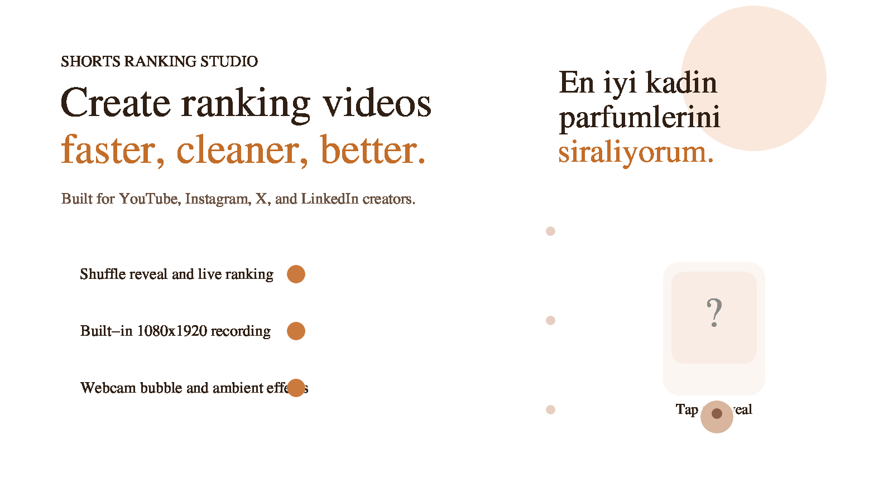
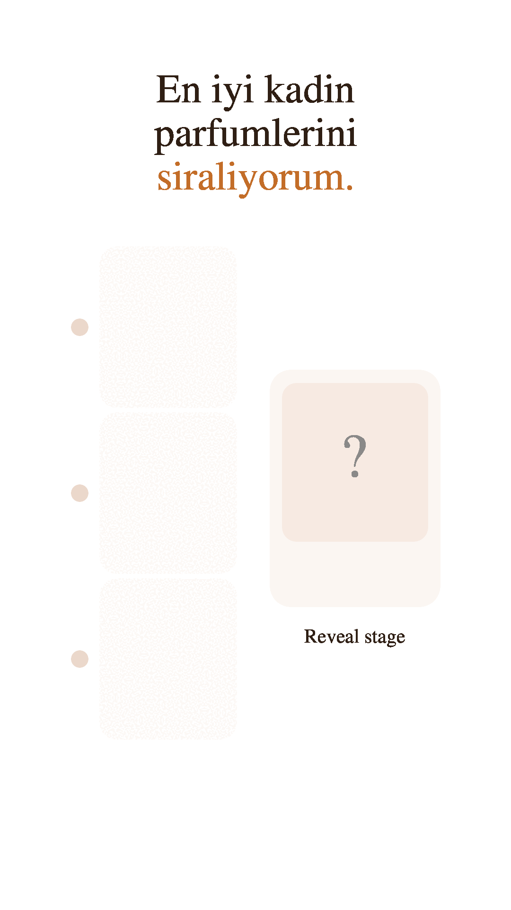

# Shorts Ranking Studio

Single-file, browser-based studio for producing 9:16 ranking videos for YouTube, Instagram, X, and LinkedIn creators.

Tek dosyalı, tarayıcı tabanlı, YouTube, Instagram, X ve LinkedIn üreticileri için 9:16 sıralama videoları hazırlama stüdyosu.

## Preview / Onizleme

Direct assets:

Dogrudan dosyalar:

- `assets/preview.png`
- `assets/demo.gif`
- `assets/demo.mp4`

## English

### What It Does

- Builds vertical ranking scenes with editable titles and item lists
- Supports text-only, image-only, or mixed cards
- Reveals items with shuffle animation and lets you rank them live
- Includes optional hearts, likes, join toasts, transparent stage mode, and mini camera bubble
- Records the stage as a dedicated 1080x1920 export with microphone, effects, background media, and webcam bubble

### Target Audience

- X creators building fast, debate-driven ranking posts and video clips
- LinkedIn creators packaging opinionated ranked content in a cleaner visual format
- YouTube creators producing Shorts around rankings, comparisons, and hot takes
- Instagram creators publishing Reels around beauty, culture, food, sports, and entertainment

### Main File

- `shorts-ranking-studio.html`

### How To Use

1. Open `shorts-ranking-studio.html` in a modern browser.
2. Edit the title, final hook, item count, and item media.
3. Choose placement modes, effects, and background options.
4. Switch to record mode if you want a cleaner preview.
5. Use the built-in recorder:
   - `Kaydi baslat`
   - perform the ranking
   - `Kaydi durdur`
   - `Videoyu indir`

### Best Use Cases

- Best perfumes ranking
- Best movies ranking
- Best football players ranking
- Best restaurants ranking
- Best songs ranking
- Hot takes, comparisons, and community debate content

### Target Platforms

- X
- LinkedIn
- YouTube
- Instagram

### Positioning

This project is not a generic randomizer. It is a creator tool designed specifically for fast, repeatable short-form ranking videos.

### Suggested Repo Metadata

- Name: `shorts-ranking-studio`
- Short description: `A single-file 9:16 ranking video studio for YouTube, Instagram, X, and LinkedIn creators.`
- Topics: `youtube-shorts`, `instagram-reels`, `x`, `linkedin`, `ranking`, `creator-tools`, `html`, `javascript`, `single-file`, `video-tools`

## Turkce

### Ne Ise Yarar

- Duzenlenebilir baslik ve oge listesiyle dikey siralama sahneleri kurar
- Sadece yazi, sadece gorsel veya ikisinin birlikte oldugu kartlari destekler
- Ogeyi karistirma animasyonuyla acar ve canli olarak siralamaya yerlestirmeni saglar
- Kalp, like, giris bildirimleri, transparent zemin ve mini kamera balonu gibi opsiyonel efektler sunar
- Mikrofon, efektler, arka plan medyasi ve kamera balonu dahil 1080x1920 export kaydi alir

### Hedef Kitle

- Hizli, tartisma doguran siralama icerikleri ureten X kullanicilari
- Daha temiz ve profesyonel gorunen fikir icerikleri ureten LinkedIn kullanicilari
- Karsilastirma, hot take ve ranking Shorts videolari hazirlayan YouTube ureticileri
- Guzellik, kultur, yemek, spor ve eglence odakli Reels ureten Instagram kullanicilari

### Ana Dosya

- `shorts-ranking-studio.html`

### Nasil Kullanilir

1. `shorts-ranking-studio.html` dosyasini modern bir tarayicida ac.
2. Basligi, final metnini, oge sayisini ve kart iceriklerini duzenle.
3. Yerlestirme modlarini, efektleri ve arka plan seceneklerini ayarla.
4. Daha temiz bir gorunum icin kayit moduna gec.
5. Yerlesik kayit sistemini kullan:
   - `Kaydi baslat`
   - siralamayi yap
   - `Kaydi durdur`
   - `Videoyu indir`

### En Uygun Icerik Tipleri

- En iyi kadin parfumleri
- En iyi filmler
- En iyi futbolcular
- En iyi restoranlar
- En iyi sarkilar
- Yorum tetikleyen hot take ve karsilastirma icerikleri

### Hedef Platformlar

- X
- LinkedIn
- YouTube
- Instagram

### Konumlandirma

Bu proje genel bir rastgele secici degil. Hizli ve tekrar edilebilir kisa video uretimi icin tasarlanmis bir creator aracidir.

### Onerilen Repo Bilgileri

- Ad: `shorts-ranking-studio`
- Kisa aciklama: `A single-file 9:16 ranking video studio for YouTube, Instagram, X, and LinkedIn creators.`
- Konular: `youtube-shorts`, `instagram-reels`, `x`, `linkedin`, `ranking`, `creator-tools`, `html`, `javascript`, `single-file`, `video-tools`
